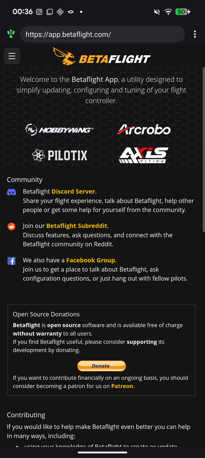
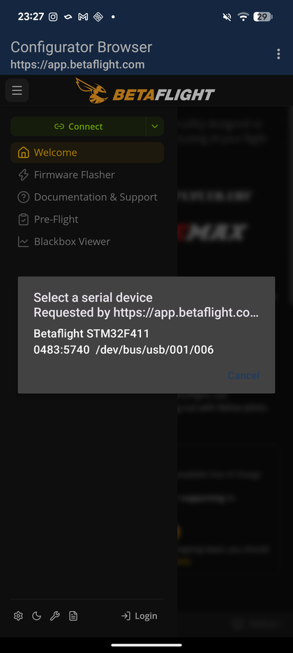
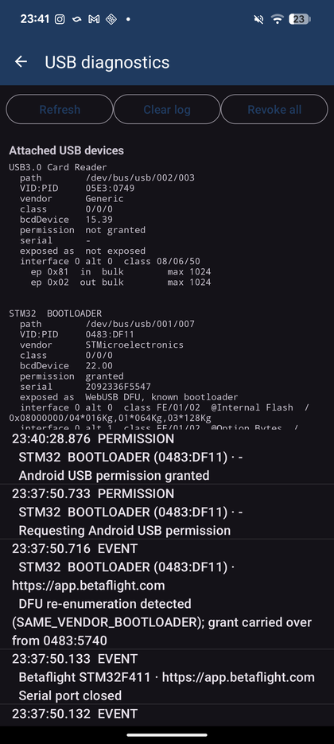

# WebSerial Browser

[](https://github.com/SchoepsLabs/webserial-android/actions/workflows/ci.yml)
[](https://github.com/SchoepsLabs/webserial-android/releases/latest)
[](LICENSE)

**Web Serial and WebUSB for Android — one USB bridge for every hardware web app.**

The Android **WebView** has neither **Web Serial** nor **WebUSB**. This is a
browser that implements both on top of the Android USB Host API and hands them
to pages you trust.

Where Chrome for Android sits today, accurately:

| | Chrome for Android | this app |
| --- | --- | --- |
| WebUSB | yes, since Chrome 61 | yes |
| Web Serial | [only since Chrome 148](https://chromestatus.com/feature/6043992171085824) (April 2026), partial, and USB serial is limited to a subset of devices | yes, on anything with USB host |

So the gap this fills is narrowing, and worth being honest about: if your phone
and browser are new enough, some of this already works in plain Chrome. What you
still get here is Web Serial that does not depend on your device being on the
supported list, four USB-serial chip drivers instead of whatever the platform
exposes, per-origin USB permissions, and a diagnostics screen that tells you why
a board did not connect.

It ships knowing four FPV configurators, but nothing in the bridge is
FPV-specific: it is a generic Web Serial / WebUSB implementation, and you can
point it at any site.

**4.8 MB, for all of them.** Betaflight's own Android build is 15 MB and covers
one tool; their Tauri build is 89 MB. This is small for the same reason it is
always current — it bundles no web assets at all. The entire bridge is two
JavaScript files; everything else in the APK is icons and Kotlin.

**One app instead of one per tool.** Every configurator that wants to talk to
hardware from a phone otherwise needs its own native Android build, with its own
USB permission handling and its own release channel. Most never get one. This is
the bridge written once, so the web app you already use just works — and the
tools that were never going to ship an Android app work too.

> **Unofficial.** Not affiliated with, endorsed by, or produced by Betaflight,
> ESC Configurator, AM32, ExpressLRS or any other project. Those are independent
> websites this browser can load, exactly as any browser can. All trademarks
> belong to their owners.

<p>
  
  
  
</p>

## Install

Grab the APK from [Releases](../../releases) and open it on your phone. Android
will ask you to allow installing from unknown sources.

Requires **Android 7.0+**, a phone with **USB host** support, and an OTG cable or
hub. Android System WebView must be recent enough for `DOCUMENT_START_SCRIPT`
(WebView 106+, i.e. anything updated since 2022) — the app says so if it is not.

### What you will see when installing

Android warns about any app that did not come from a store. This is normal for a
sideloaded APK and is not specific to this one:

1. **"For your security, your phone is not allowed to install unknown apps from
   this source"** — allow it for whichever app you are installing from, usually
   your browser or the file manager.
2. **Play Protect may say the developer is not recognised** — tap *More details*,
   then *Install anyway*. Play Protect builds recognition from install volume, so
   a new app always looks unfamiliar to it.

The app is signed with a key registered under
[Android developer verification](https://developer.android.com/developer-verification),
so it stays installable when that becomes mandatory.

### Verify a download

An app that asks for USB access to your hardware is worth checking first. Every
release publishes its APK's SHA-256 in the release notes and as a
`.sha256` file next to the APK, so you can confirm the download is byte-for-byte
what was published:

```
shasum -a 256 -c <apk>.sha256
```

The stronger check is the signing key, because it does not change from one
version to the next. Every release so far is signed with this certificate:

```
SHA-256  98:BA:F6:B1:AF:BB:09:69:CA:EB:48:8E:D5:E5:B1:32:7E:7F:7B:8E:52:4C:85:33:04:77:F2:23:D0:46:D1:47
```

`apksigner verify --print-certs -v <apk>` prints it. An APK claiming to be this
app but signed with anything else did not come from here — do not install it.
Android enforces the same rule: an update signed with a different key cannot
install over an existing one. Signature scheme v3 does allow the key to be
rotated later without orphaning existing installs; if that ever happens it will
be announced in the release notes, so treat an unannounced change as a red flag.

Once installed: plug in a board, open a configurator, hit **Connect**, and pick
the device when the app asks. The app tells you when a new release exists; it
never downloads or installs anything itself.

## Privacy

The app collects nothing and has no analytics or accounts. It declares only
`INTERNET` and `ACCESS_NETWORK_STATE` — **no storage permission of any kind**,
because file access goes through Android's own save/open dialogs, and USB access
through Android's own per-device permission prompt.

It makes exactly one network request of its own: once a day it asks
`api.github.com` whether a newer release exists, sending nothing but the request
itself. Turn it off under **Check for updates** and it never calls out again.
Pages you visit reach the network on their own behalf, as in any browser.

## Bundled sites

These four ship with USB enabled:

| Site | |
| --- | --- |
| <https://app.betaflight.com> | Betaflight Configurator |
| <https://esc-configurator.com> | ESC Configurator (BLHeli_S / Bluejay / AM32) |
| <https://am32.ca> | AM32 Configurator |
| <https://expresslrs.github.io> | ExpressLRS Web Flasher |

They are presets, not the product. Type **any** address into the bar — a site
reaches USB only after you explicitly enable it for that origin, behind a
warning, and each origin only ever sees the devices you picked there. See
[Sites and USB access](#sites-and-usb-access).

Betaflight also publishes [its own Capacitor Android APK](https://downloads.betaflight.com/).
It is official and supported — but its Capacitor config is `"webDir": "src/dist"`,
so it **bundles a frozen build**: a new Betaflight release means downloading a new
APK. This browser loads the live site, so the configurator is whatever is current
the moment you open it, and the only thing you ever update is the bridge underneath.

Loading live does not mean needing a connection. Betaflight and ESC Configurator
are both progressive web apps and their service workers run here, so once a site
has been opened online it keeps working offline — measured, see
[Working offline](#working-offline).

## Should work, untested

The bridge is a generic Web Serial / WebUSB implementation, so anything that
works in desktop Chrome over those APIs is a candidate — ESP Web Tools
installers (WLED, ESPHome, Tasmota), `esptool-js`, Meshtastic's web flasher,
WebDFU, WebADB.

Treat that as *plausible*, not proven. The catch is the serial driver: only
CDC-ACM has met real hardware. Most ESP32/ESP8266 boards use CP210x or CH340,
and those drivers follow the MIT-licensed usb-serial-for-android implementation
but have never been run.
See Status.

## Status

Verified against real hardware (Pixel 8 Pro, Android 16, Betaflight STM32F411):

- Betaflight connects, streams live telemetry, and reads firmware info over MSP
- ESC Configurator connects through the 4-way passthrough
- A board sent to DFU is detected, re-authorised and picked up by the configurator
- Per-origin isolation holds: only the site you picked the device in can see it
- Saving a CLI diff writes a real file through the Android save dialog

**Not yet proven on hardware**, and worth knowing before you rely on it:

| | |
| --- | --- |
| WebUSB transfers (`controlTransferIn` etc.) | only run during an actual flash |
| CP210x / CH34x / FTDI drivers | checked line by line against [usb-serial-for-android](https://github.com/mik3y/usb-serial-for-android), but still never run on hardware — this is what an ESP32 board would use |
| Android 7–9 | minSdk claims support; only ever run on 16 |

CDC-ACM — every STM32/AT32/GD32/APM32/X32/RP2040 flight controller — is the one
serial driver proven in the field.

### Credits

The CH34x and FTDI baud-rate encodings and the CH34x initialisation sequence
follow [usb-serial-for-android](https://github.com/mik3y/usb-serial-for-android)
by Mike Wakerly and Google, under the MIT licence — the full notice is in
[THIRD_PARTY_NOTICES.md](THIRD_PARTY_NOTICES.md). Reading it caught real bugs: the first hand-written CH34x encoder wrote
the wrong register format entirely, and the FTDI one had two sub-divisor cases
swapped and put the carry bit in the wrong field.

## Build

```bash
./gradlew assembleDebug          # app/build/outputs/apk/debug/
./gradlew assembleRelease        # needs keystore.properties, see below
```

Run the tests:

```bash
./gradlew testDebugUnitTest && node --test "js-tests/**/*.test.mjs"
```

Release signing reads `keystore.properties` from the project root (gitignored):

```properties
storeFile=release.keystore
storePassword=...
keyAlias=...
keyPassword=...
```

---

## What the two configurators actually call

Mapped by reading the repositories, not from the specs. Line references are to the
upstream `master` at the time of writing; the deployed builds may lag, so treat the API
*surface* as the contract rather than the exact lines.

### Betaflight Configurator — `src/js/protocols/WebSerial.js`

| Call | Detail that matters |
| --- | --- |
| `navigator.serial.addEventListener("connect"/"disconnect")` | reads **`e.target`**, and matches the removed device with `port.port === e.target` — so the event must be dispatched on the `SerialPort` |
| `navigator.serial.getPorts()` | rebuilt on every device event; port objects are keyed in a `WeakMap`, so the same device must return the *same object* |
| `navigator.serial.requestPort(options)` | `{filters: [{usbVendorId, usbProductId}]}` or `{}` |
| `port.getInfo()` | `{usbVendorId, usbProductId}`, used for the display name |
| `port.open({baudRate})` / `port.close()` | |
| `port.writable.getWriter()` / `port.readable.getReader()` | uses `reader.cancel()`, `releaseLock()`, and checks `reader.locked` |
| `port.addEventListener("disconnect")` | **the port itself is an EventTarget** |

### Betaflight Configurator — `src/js/protocols/WebUsbDfuTransport.js`, `UsbDfuDescriptors.js`

| Call | Detail that matters |
| --- | --- |
| `navigator.usb.addEventListener("connect"/"disconnect")` | reads **`e.device`** |
| `navigator.usb.getDevices()` | polled by `waitForDfuDevice()` — this *is* the DFU re-enumeration detector |
| `navigator.usb.requestDevice({filters})` | reads `deviceVersionMajor/Minor/Subminor` off the result |
| `device.open()`, `close()`, `selectConfiguration(1)` | called only when `device.configuration === null`, so it must start null |
| `device.claimInterface()`, `releaseInterface()` | |
| `device.reset()` | used by `usbdfu.js` as the last step of a flash — **not** in the original requirement list |
| `controlTransferIn(setup, length)` → `{status, data}` | **must not reject on a stall.** The descriptor layer decides what a stall means; an unsupported LANGID read is recoverable. `data` is consumed as a `DataView` |
| `controlTransferOut(setup, data)` → `{status}` | |

DFU descriptors are read through **raw `GET_DESCRIPTOR` control transfers**, not through
`device.configurations`, so both `standard`/`device` and `class`/`interface` request
combinations have to work. Neither app calls `transferIn`/`transferOut`; they are
implemented anyway.

### ESC Configurator — `src/utils/LocalStorage.js`, `Serial.js`, `Containers/App/index.jsx`

| Call | Detail that matters |
| --- | --- |
| `'serial' in navigator` | feature detection — `navigator.serial` must be a real own property |
| `navigator.serial.requestPort()` | **called with no arguments at all** |
| `getPorts()`, `getInfo()`, `open({baudRate})`, `readable`/`writable`, `close()` | teardown order is `reader.cancel()` → `releaseLock()` → `writer.releaseLock()` → `port.close()` |

ESC Configurator uses no WebUSB; it reaches ESCs through the flight controller's 4-way
MSP passthrough.

### One thing that could have broken everything

Betaflight's `isAndroid()` (`src/js/utils/checkCompatibility.js:58`) tests
`Capacitor.isNativePlatform()`, **not** the User-Agent. In a plain WebView it is false, so
the app takes the ordinary `navigator.serial` path. No UA spoofing is needed, and adding
any would be actively harmful.

---

## Design

```
   app.betaflight.com / esc-configurator.com   (live, over the network)
                     │
        polyfill.js  │  injected at document start, origin-scoped
                     │  navigator.serial + navigator.usb
                     ▼
        AndroidConfiguratorBridge     WebMessageListener, origin-scoped
                     │                JSON RPC, binary as base64
                     ▼
             ConfiguratorBridge       op dispatch, per-origin handles
                     │
        ┌────────────┼─────────────┐
        ▼            ▼             ▼
   SerialSession  UsbSession    UsbHub
   + drivers                    devices, permissions, grants,
   CDC-ACM                      attach/detach, DFU handoff
   CP210x CH34x FTDI
```

<a id="sites-and-usb-access"></a>

### Sites and USB access

Navigation and USB are deliberately separate questions. Navigation is open —
it is a browser, you can type any address. USB is not.

- The four configurators above ship with USB enabled.
- Any other site starts with USB **off**. Enabling it takes an explicit tap on
  the USB chip in the address bar (or the switch under *Sites*), and shows a
  warning first. A stray tap on the switch bounces back until the dialog is
  accepted.
- Access can be revoked at any time, including for the built-ins.

Because origin rules are fixed when the injections are registered, changing the
policy re-registers both and reloads the page — a site cannot gain or keep access
mid-document.

Desktop Chrome hands `navigator.serial` to *every* site and relies on the device
picker alone. This app does not, because a WebView has no site isolation to fall
back on: the picker is the second gate here, not the only one.

### Saving and opening files

An Android WebView *does* expose a File System Access API — but only half of it
works. `showOpenFilePicker` opens a real picker; `showSaveFilePicker` exists,
resolves never, and throws nothing. Combined with `blob:` downloads being
silently dropped, **every save button in both configurators did nothing** —
presets, CLI diffs, blackbox dumps, ESC's `dump.hex` — with no error anywhere.

The shims therefore replace the host implementations **unconditionally**.
Detecting the API by existence is the wrong test when the API is present but
dead, and that mistake cost an afternoon of debugging.

Four mechanisms cover it:

| Path | Used by |
| --- | --- |
| `showSaveFilePicker` / `showOpenFilePicker` → Storage Access Framework | Betaflight's preferred path (`src/js/FileSystem.js`), including its streaming blackbox writer |
| `<a download>` with a `blob:`/`data:` href, intercepted | ESC's `dump.hex` and log export, Betaflight's blackbox-viewer and backups |
| `<input type="file">` → `onShowFileChooser` | firmware, presets, ESC hex files |
| `http(s)` downloads → `DownloadManager` | anything served as a normal file |

The interception patches `HTMLAnchorElement.prototype.click` rather than only
listening for click events, because a page is free to build an anchor and click
it without ever inserting it into the document — a listener would miss those.
Writes are streamed and chunked so a multi-megabyte blackbox log never becomes
one oversized bridge message.

### Never expose native USB to untrusted sites

Four independent layers, in order of what an attacker would have to defeat:

1. **`addDocumentStartJavaScript` is origin-scoped.** A page without USB access never
   receives the polyfill, so `navigator.serial` and `navigator.usb` simply do not exist
   there.
2. **`addWebMessageListener` is origin-scoped.** The `AndroidConfiguratorBridge` object is
   not injected off-list. There is deliberately **no `addJavascriptInterface` anywhere** —
   that one is global to every origin.
3. **Every inbound message re-checks the origin** (`OriginPolicy.isAllowed`) rather than
   trusting WebView's rule matching. `normalize()` rejects non-https schemes and URLs that
   smuggle a different authority through userinfo (`https://app.betaflight.com@evil.test/`).
4. **Grants are per-origin.** Web Serial's `getPorts()` and WebUSB's `getDevices()` return
   only devices *that origin* was granted, so allowed sites cannot enumerate each
   other's hardware. Device access always requires an explicit native picker
   selection plus the Android USB permission dialog.

Main-frame navigation to anything that is **not** a plain https URL — `mailto:`,
`intent:`, `market:` — is handed to the system. Ordinary https pages load here
regardless of the site list; being off the list withholds USB, not navigation.

### DFU re-enumeration

This is the sharpest edge in the whole app. A flight controller entering DFU mode drops
off the bus and comes back as a **different `UsbDevice` instance** with a different
VID/PID — and Android grants USB permission per instance. Untreated, a permission dialog
appears in the middle of a flash while `waitForDfuDevice()` polls a `getDevices()` that
returns nothing.

Three things address it:

- `res/xml/device_filter.xml` + the manifest `USB_DEVICE_ATTACHED` filter let the user make
  this app the default handler for these boards, so the grant persists.
- `DfuTransition` opens a 30-second window when a *granted* device detaches. A bootloader
  attaching inside that window is matched back to the origin by serial number, then by
  vendor, then — only if exactly one board is outstanding — by being the sole candidate.
  Two ambiguous candidates fall back to the normal prompt rather than guessing.
- On a matched handoff the app requests USB permission immediately, so the device is
  visible to `getDevices()` before the page's poll gives up.

`GrantStore` keys a grant on VID/PID/serial rather than the Android device path, which
changes on every re-enumeration. Because Android hides the serial number until permission
is granted, an unknown serial on either side matches on VID/PID — otherwise a grant would
evaporate at the exact moment permission arrived.

### Serial drivers

| Driver | Devices | DTR/RTS | Break |
| --- | --- | --- | --- |
| CDC-ACM | STM32, AT32, GD32, APM32, X32, RP2040 VCP — effectively every FC | `SET_CONTROL_LINE_STATE` | yes |
| CP210x | Silicon Labs USB-UART | `SET_MHS` with a write mask | yes |
| CH34x | WCH CH340/CH341 | vendor modem-control write | no (reported as unsupported) |
| FTDI | FT232R and relatives | `SIO_MODEM_CTRL` | yes |

The FTDI read path strips the two modem-status bytes the chip prepends to *every* USB
packet — per packet, not per transfer, or the stream corrupts every 64 bytes.

`DeviceCapabilities` decides from the interface descriptors whether a device is offered to
Web Serial, to WebUSB, or both, so a DFU bootloader does not appear as a bogus serial port.

### Diagnostics

`DiagnosticsActivity` is native rather than a page in the WebView, so it still works when
the bridge is the broken thing. It shows attached devices with interfaces, alternates and
endpoints; Android permission state; which polyfill each device is exposed through;
per-origin authorisations; and a bounded ring of every transfer that crossed the bridge,
including DFU handoff decisions and rejected messages.

---

## Tests

**JS bridge — 56 tests, `node --test "js-tests/**/*.test.mjs"`.** These load the *shipped*
`app/src/main/assets/bridge/polyfill.js` into a `node:vm` context against a mock bridge, so
there is no second copy to drift. The ones that matter most pin the behaviours that pass a
naive test but break real hardware:

- a serial connect/disconnect event has `event.target === port`
- a usb connect event has `event.device`
- the port's own `disconnect` listener fires
- a stalled `controlTransferIn` resolves `{status: "stall"}` instead of rejecting
- `device.reset()` resolves even when native fails it
- `requestPort()` with no arguments
- the same handle always returns the same object
- a 200 KB write survives base64 chunking byte-for-byte

**Kotlin — 97 tests, `./gradlew testDebugUnitTest`.** Base64 round-trips including a 512 KB
payload, RPC framing and error mapping, filter parsing in both spellings, origin policy
including look-alike hosts and userinfo smuggling, per-origin grant isolation and the
serial-number matching rule, the DFU handoff state machine, `bmRequestType` assembly, and
the handle registry — where a test pins that one CDC board gets a *distinct* handle per
role, because collapsing them makes a detach announce only one of the two.

## Verified on hardware

Pixel 8 Pro, Android 16, WebView 150, against a **Betaflight STM32F411** flight controller
(`0483:5740`, CDC-ACM: interface 0 class `02/02/01` with an interrupt endpoint, interface 1
class `0A/00/00` with a bulk pair).

Betaflight Configurator 2026.6.1, loaded live, reported:

```
User Agent: [object NavigatorUAData]
Native: false      Android: false      Tauri: false     ← plain web path, no UA spoofing
Serial: true       USB: true                            ← both polyfills detected
[WEBSERIAL] User selected SERIAL device from permissions: serial_0
[WEBSERIAL] Connection opened with ID: serial_0, Baud: 115200
[SERIAL-BACKEND] Requesting configuration data
Fw git rev: efef897                                     ← real MSP data read off the board
Arming disable
Real time clock set                                     ← MSP writes working
Loading progress: 753439/753439 (100%)
```

The configurator moved to its connected state with the full tab set. ESC Configurator loads
and detects the serial polyfill (it offers "Select Serial Port" rather than its
unsupported-browser screen).

### Slider gestures, measured on device

Both configurators had sliders that a touch could not drive, for two unrelated reasons.
Measured through the WebView's own devtools, on each site's real origin.

ESC Configurator's sliders are `react-input-range`: a `div` thumb inside a `span` that also
holds the value label. A touch on that label read as a long-press on text, so a selection
started and the drag never reached the slider. Computed styles on that exact markup, on
`esc-configurator.com`:

```
                      with the fix      without
.input-range root     none / pan-y      auto / auto
value label           none              auto        <- the text that was being grabbed
thumb                 none / none       auto / auto
ordinary paragraph    auto              auto        <- still selectable, deliberately
```

Betaflight's motor tab is Nuxt UI's `USlider` (reka-ui) with `orientation="vertical"`, which
emits `role="slider"` and `data-orientation` but no `touch-action` of its own. The browser
was free to read a drag as a page pan, so a motor slider moved sometimes and scrolled the
page the rest of the time. Dispatching a real 140 px touch drag up the slider, on
`app.betaflight.com`:

```
slider, fix on    scrollTop  0    <- gesture stays with the slider
slider, fix off   scrollTop  132  <- the reported bug, reproduced
beside it, on     scrollTop  132  <- the page still scrolls normally
```

The track computes `touch-action: auto` and is still governed, which confirms the ancestor
intersection the rule relies on: `none` on the slider root covers the track and thumb inside
it.

### Working offline

Both configurators are progressive web apps, and a WebView runs their service
workers, so their own caching applies here — no offline mode had to be built.
Measured by cutting the network at the devtools protocol and doing a full reload
on `esc-configurator.com`:

```
navigator.onLine  false
title             ESC Configurator - for Bluejay, BLHeli_S and AM32
rendered          port selection, baud rates, Connect, language list
```

The first visit has to be online to populate that cache, and it is the site's
cache, not the app's — clearing site data clears it.

### Gestures the system used to steal

Two problems came from the phone rather than the page, both measured on device.

The address bar could vanish for good. `expand` was only ever posted from a
scroll event, so on a page that does not scroll, or once already at the top,
nothing could bring it back. A downward drag that scrolls nothing now reveals it:
collapsed, confirmed gone from the view hierarchy, then dragged down with
`scrollY` pinned at 0 and it returned to exactly its original bounds.

ESC Configurator's knobs sit close to the left edge, so a drag on one was also an
Android back swipe and the page navigated away mid-adjustment. The page reports
edge-hugging sliders and the app excludes them. A test slider at CSS
`(0,300)-(120,340)` produced, in the window manager:

```
mSystemGestureExclusion=SkRegion((0,1195,360,1315))
system_gesture_exclusion_limit_dp=200
```

Exact at density 3, offset by the status bar and app bar above the WebView. The
200dp cap is why only on-screen sliders are ever reported.

### Drags the browser interrupts

Moving one motor slider used to move another, in both configurators. Neither
slider library ends a drag when the browser cancels the gesture to pan:
`react-input-range` adds document `touchmove`/`touchend` on touchstart and
removes them on `touchend` only; `reka-ui` pairs `setPointerCapture` with
`releasePointerCapture` on `pointerup` only. Neither listens for the cancel, so
an interrupted drag never ends and that slider follows every later drag.

The app supplies the end event each library waits for. In the WebView, a
`pointercancel` on a slider now produces a `pointerup` carrying the same pointer
id, a `touchcancel` produces a `touchend`, and a cancel outside a slider is left
untouched.

### DFU re-enumeration, on hardware

The board was sent to its bootloader with the CLI `bl` command. The serial side closed
cleanly (`Sent: 33191 bytes, Received: 297587 bytes`) and the transfer log recorded the
handoff:

```
23:37:50.133  Betaflight STM32F411 · Serial port closed
23:37:50.716  STM32 BOOTLOADER (0483:DF11) · https://app.betaflight.com
              DFU re-enumeration detected (SAME_VENDOR_BOOTLOADER);
              grant carried over from 0483:5740
23:37:50.733  Requesting Android USB permission
23:40:28.876  Android USB permission granted
```

The bootloader then enumerated with its DFU alternates parsed:

```
STM32 BOOTLOADER   0483:DF11   permission granted   serial <redacted>
  exposed as  WebUSB DFU, known bootloader
  interface 0 alt 0  class FE/01/02  @Internal Flash /0x08000000/04*016Kg,01*064Kg,03*128Kg
  interface 0 alt 1  class FE/01/02  @Option Bytes /...
```

Betaflight's device picker switched to **"Betaflight STM32 BOOTLOADER"**, i.e. the board
reached the page through `navigator.usb.getDevices()`.

The match was **SAME_VENDOR_BOOTLOADER**, not SAME_SERIAL: this board reports `0x8000000`
in application mode and a different one in DFU. Serial-only matching would have failed on
real hardware — the vendor fallback is what carried it.

**Not proven on hardware:** the WebUSB *transfer* path. `WebUsbDfuTransport.open()` →
`claimInterface` → `controlTransferIn` only runs once a flash begins, so no `CONTROL_IN`
entry appears in the log above. Those paths are covered by unit tests (including the
stall-not-reject contract) but have not moved bytes over real USB.

Two bugs only real hardware exposed, both fixed:

- **The device picker rendered empty.** `AlertDialog.Builder` was given both `setMessage()`
  and `setItems()`; `AlertController` only renders the item list when no message is set, so
  every device was silently hidden. The requesting origin now goes in the title.
- **A USB mass-storage device was classified as a serial port.** The "vendor-specific device
  with a bulk pair" fallback in `DeviceCapabilities` matched a card reader on a hub. Known
  non-serial interface classes are now excluded, and the diagnostic screen confirms the
  reader reads `exposed as not exposed` while the FC still reads `exposed as Web Serial`.

## Known limits

- `device.reset()` is best-effort: Android exposes no libusb-style port reset, so it
  releases interfaces and reopens the connection.
- `usbVersionMajor/Minor/Subminor` report 2.0.0; Android does not expose `bcdUSB`. Neither
  configurator reads it beyond logging.
- CDC modem status (DCD/DSR/RI) comes from the interrupt endpoint's `SERIAL_STATE`
  notification and is cached; CTS is not reported by that path.
- The bridge moves binary as base64 over JSON. A firmware flash is on the order of a
  thousand round trips, which is comfortably fast; a binary `WebMessagePayload` would be a
  later optimisation, not a correctness fix.
- Requires an Android System WebView new enough for `DOCUMENT_START_SCRIPT` and
  `WEB_MESSAGE_LISTENER` (WebView 106+). The app detects this and says so rather than
  failing obscurely.
- The CDC-ACM driver is proven against real hardware; **CP210x, CH34x and FTDI are not**.
  Their register sequences follow the MIT-licensed
  [usb-serial-for-android](https://github.com/mik3y/usb-serial-for-android) — see
  [THIRD_PARTY_NOTICES.md](THIRD_PARTY_NOTICES.md) — but have never been run against a
  physical adapter — the FTDI baud divisor and per-packet status-byte stripping are the
  most likely places for a first bug.
- A USB device already claimed by another app that holds a persistent "open by default"
  grant will be handed to that app on attach. Choose **WebSerial Browser** in the
  system chooser if more than one app claims the board.
